Given the increasing ability for neural networks to model natural language accurately, there are a growing number of applications for open-ended neural generation tasks. Yet, recent efforts in open-ended generation continue to present questions as to why likelihood-maximization methods, such as greedy search, produce degenerate outputs. This issue, and the natural replaceability of words, motivates the use of stochastic, sampling based approaches. However, sampling in a way that generates both high quality and diverse outputs remains a non-trivial problem.

As a result, I have developed Tail Free Sampling, a new sampling method I argue is more theoretically sound than the existing sampling approaches: Top-K and Nucleus ([Fan et al. \[2018\]](https://arxiv.org/abs/1805.04833); [Holtzman et al. \[2019\]](https://arxiv.org/abs/1904.09751)). It also requires less hyperparameter tuning and offers greater interpretability.

Nevertheless, this project is stuck at the empirical validation stage. The reasons for the problem and my attempts to solve it are outlined at length later. The underlying source of difficulty is that sampling methods improve the quality of the average generation not by increasing the quality of the very best generations, but by raising the quality of the worst. I would be very interested in collaborating with anyone who has ideas for how to validate different open-ended generation sampling methods. To my knowledge this is something that has not been done in any previous paper utilizing Top-K or Nucleus Sampling.

Though this project is stuck at empirical validation, I urge researchers to consider using Tail Free Sampling for their open generation tasks if they find its underlying motivations compelling. Existing methods like Nucleus and Top-K Sampling also rely upon theory alone, making Tail Free Sampling both a useful and competitive alternative.

Update (Feb. 2022) - Tail Free Sampling is now being used in [production](https://goose.ai/playground) and discussed by groups like [ElutherAI](https://www.eleuther.ai/). However, I still am unaware of any statistically significant direct comparisons with other methods.

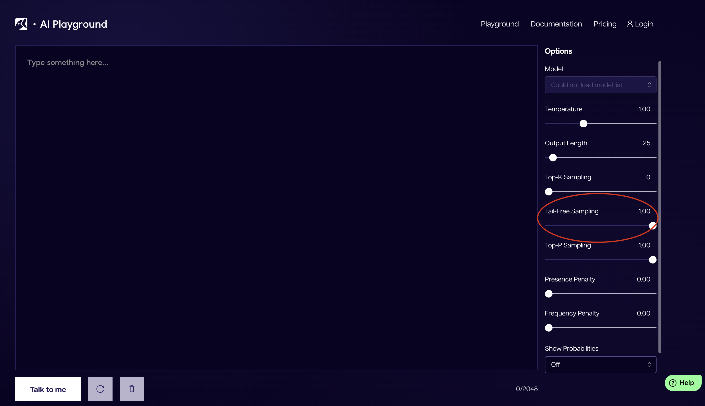{:style="width: 700px;"}

<div align="center">
  
</div>


This blog post provides:
1. A [summary](#summary) of the problem of open-ended generation and motivation behind Tail Free Sampling
2. [Background](#background) on previous approaches
3. The Tail Free Sampling [Algorithm](#tail-free-sampling-algorithm)
4. [Experiments](#experiments) between Tail Free Sampling, Top-K, and Nucleus Sampling
5. Attempts at empirical [validation](#empirical-validation) of Tail Free Sampling

All code and analyses used for this post are publicly available at: <https://github.com/TrentBrick/tail-sampling>. A ready to use, parallelized implemention of the algorithm in Tensorflow is available at: <https://github.com/TrentBrick/TailFreeSampling>.

## Summary

Say you're an avid Dungeons and Dragons (D&D) player and have trained an autoregressive neural network on lots of existing examples of D&D adventures. You now want to use machine learning to generate new adventures that have never existed before.

How do you generate new text from the trained model? This turns out to be a difficult problem. For close-ended generations, where the length of the output is predictable from the input, likelihood-maximization strategies, such as greedy search and beam search perform well. Examples of close-ended generation include image captioning and machine translation.

However, for something like D&D adventures, which can be of very different lengths, there is no clear point at which a generation should stop. Thus, these generations are considered "open-ended". Trying to use likelihood-maximization strategies to approximate the highest probability generations currently fails: resulting in highly repetitive and nonsensical outputs.

As a result, sampling strategies must be used to create diversity. But, we can't sample from the whole distribution of words as this risks derailing the model by sampling a low probability word. Therefore, sampling must be constrained to only a promising subset of the highest probability words. How can we find the correct trade-off between sampling enough words to create diversity but not too many to harm quality?

Initially, the solution to this problem was Top-K sampling ([Fan et al. \[2018\]](https://arxiv.org/abs/1805.04833)). At every point in a sequence generation, all but the top K probability words are removed, the remaining K words' probabilities are re-normalized, and then sampled from. This K is fixed for every single generation step.

Top-K has worked fairly well, with a K-value of 40 being common ([Radford et al. \[2019\]](https://d4mucfpksywv.cloudfront.net/better-language-models/language_models_are_unsupervised_multitask_learners.pdf)). However, a problem with this approach, realized by [Holtzman et al. \[2019\]](https://arxiv.org/abs/1904.09751), is that in different contexts there will be fewer or more words that should be considered and sampled from. For example, the sentence "the cat sat on the \_\_\_\_" has only a few very high probability words to fill in the blank, like "mat". Meanwhile, "I ate the _____" could be any possible food item, meaning more words should be considered and sampled from. Rather than keeping the same fixed K words, the number kept should be in proportion to their probability distribution.

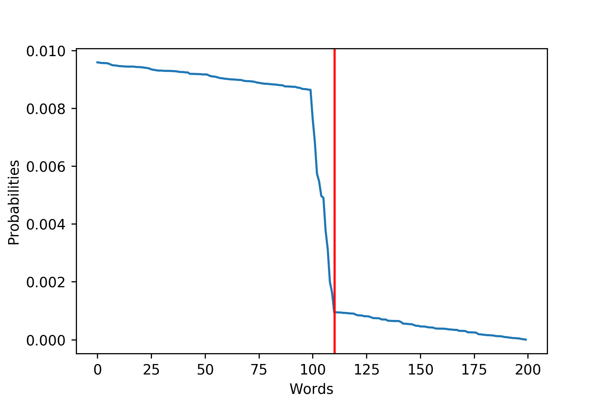{:style="width: 300px;"} {:style="width: 300px;"}

*Figure 1. These plots are examples of more uniform and exponential probability distributions over the words. I plotted red lines to try and emphasize where the tails of the distributions may be. This is trying to emphasize that for different distributions there are more or fewer reasonable words.*

This insight motivated Nucleus Sampling, which dynamically changes the number of words to prune by using the cumulative distribution function (CDF) of the word probabilities ([Holtzman et al. \[2019\]](https://arxiv.org/abs/1904.09751)). The hyperparameter *n* must be set as a threshold for this CDF.

I argue that Nucleus Sampling, while clever in dynamically updating the cut off threshold, fails to explicitly capture what we want: the point at which the next words considered no longer become "replaceable", which is revealed by their probabilities plateauing.

Tail Free Sampling finds this point of plateau explicitly by using the second derivative of the probability distribution rather than its CDF to more accurately find the "tail". Because the point of plateau isn't precisely defined, Tail Free Sampling still relies on a hyperparameter, $$z$$, but it is far more context robust, consistently finding the tail of the distribution while Nucleus Sampling can over or undershoot depending on the shape of a particular CDF.

## Background

### The Problem of Maximization

Current likelihood-maximizing strategies, such as greedy and beam search, fail in the domain of open-ended generation by producing short, highly repetitive outputs. This has led to many questions, investigations, and possible explanations ([Holtzman et al. \[2019\]](https://arxiv.org/abs/1904.09751); [Hashimoto et al. \[2019\]](https://www.aclweb.org/anthology/N19-1169/); [Radford et al. \[2019\]](https://d4mucfpksywv.cloudfront.net/better-language-models/language_models_are_unsupervised_multitask_learners.pdf);[Murray and Chiang \[2018\]](https://arxiv.org/abs/1808.10006); [Welleck et al. \[2019\]](https://arxiv.org/abs/1908.04319)). Reasons for likelihood-maximization's failure have included the following:
1. In order to maximize information density, surprising and less predictable words are used with a high frequency to avoid saying what is predictable. This makes language inherently hard to model and motivates the use of stochastic sampling ([Holtzman et al. \[2019\]](https://arxiv.org/abs/1904.09751); [Grice \[1975\]](https://www.ucl.ac.uk/ls/studypacks/Grice-Logic.pdf));
2. Models over-fitting to the training data ([Hashimoto et al. \[2019\]](https://www.aclweb.org/anthology/N19-1169/));
3. Likelihood-maximization optimizing for avenues down the tree of possible generations that are dead-ends with the resulting lowest entropy ([Murray and Chiang \[2018\]](https://arxiv.org/abs/1808.10006));
4. The cross-entropy loss lacking a term to penalize high probabilities assigned to previously generated tokens ([Welleck et al. \[2019\]](https://arxiv.org/abs/1908.04319)).

### The Promise of Sampling

It is likely, and in some cases has already been shown, that these ideas contribute to the degeneracy of likelihood-maximization strategies with [Welleck et al. \[2019\]](https://arxiv.org/abs/1908.04319)’s new cost function appearing particularly promising. However, one solution that addresses a number of issues with creating diverse, high quality generations is sampling. In the domain of producing natural human language, there are often a large number of options at both the word and sentence level that convey similar meaning[^bioparallel]. This motivates sampling from a set of replaceable words, rather than choosing only the best.

In addition to being theoretically sound, sampling methods are one of the most promising approaches to ensuring that generations are diverse.  They generally produce diversity in two ways:
1. Generated outputs are independent from, or only weakly correlated to, other outputs because of their stochastic nature[^autoreg]. This is a problem with likelihood-maximization strategies that many have tried to address ([Ippolito et al. \[2019\]](https://arxiv.org/abs/1906.06362); [Vijayakumar et al. \[2016\]](https://arxiv.org/abs/1610.02424); [Kulikov et al. \[2018\]](https://arxiv.org/abs/1811.00907));
2. Sampling produces diversity in the sense of deviating from the highest probability regions of the model. [Hashimoto et al. \[2019\]](https://www.aclweb.org/anthology/N19-1169/) acknowledges the trade-off between generating high quality sequences that are from high probability regions but may be a consequence of over-fitting, and producing novel sequences that represent more distant regions of probability space that can lose their quality as a result. This problem can be seen as an example of the ubiquitous explore-exploit tradeoff.

### Dangers of Derailing
It has been estimated that the "average 20-year-old native speaker of American English knows 42,000 lemmas"[^lemmas] ([Brysbaert et al. [2016]](https://www.frontiersin.org/articles/10.3389/fpsyg.2016.01116/full)). While we have large vocabularies, our neural architecture seems to very efficiently prune a large majority of words in our vocabulary so that only a few, replaceable words, remain for conscious consideration when we are speaking. Similarly, neural networks have a vocabulary of tokens that they can use to generate outputs from. While they output probabilities to all of their tokens, words which are not replaceable need to be pruned to guarentee a high quality output. As shown below, the probability of sampling at least one bad token and derailing a model's generation increases exponentially. A single bad token can ruin a generative output. However, it is particularly damaging for an auto-regressive model because it can derail the generation of every later token conditioned upon this bad one.

$$P(\text{Derailed})=1-P(\text{Good Token Sampled})^{\text{Num Sampling Steps}}$$


*Figure 2. Each line represents a different cumulative probability that a bad token is sampled at any time point (generation step).*

## Current Sampling By Pruning Methods

Having already given the high level motivations behind the different existing sampling algorithms, I briefly re-state and show them mathematically here:

Top-K Sampling prunes the vocabulary by taking the highest K probability words from the distribution, then normalizing, and sampling. This can be represented by maximizing the equation:

$$\sum_{x \in V^{(k)}} p_\theta(x|x_{<t})$$

where $$x$$ is a vector of all tokens in the vocabulary, $$p_\theta$$ is the probability distribution over the tokens in the vocabulary, parameterized by $$\theta$$, $$x_{<t}$$ is the context given for the current generation step, $$V$$ is the vocabulary and $$V^{(k)}$$ is the subset of size $$k$$ of tokens. In practice, this is achieved by sorting the probabilities for each token, and taking the top K of them.

Nucleus Sampling realized that in different contexts there will be fewer or more tokens that are replaceable. As a result it dynamically changes the pruning location by using the CDF of the token probability distribution. This is achieved by finding the smallest subset of $$x$$ tokens that satisfy the equation:

$$\sum_{x \in V^{(p)}}p_\theta(x|x_{<t})\ge p$$

where $$p \in [0,1]$$ is the probability parameter and $$V^{(p)}$$ is the smallest subset of $$V$$.

Another final approach that doesn't involve explicitly pruning words but tries to achieve the same effect is the use of temperature. This is applied when outputs of the model (often called logits) are converted into probabilities using the softmax equation:

$$p(x) = \frac{\exp(x/t)}{\sum_{x \in V}(\exp{(x/t)})}$$

where $$t$$ is the temperature. Temperature serves to increase or decrease the relative probabilities of tokens. However, temperature walks a fine line between being low enough that non-replaceable tokens are given such low probabilities they no longer threaten to derail the model and yet not so low that enough diversity remains to not make it approximately greedy.

There are two reasons that temperature sampling is not further investigated in this paper:
1. It is not mutually exclusive to the other pruning methods and could be applied either before, after, or before and after a sampling method that prunes;
2. Applying a temperature alters the relative probability of the tokens, changing the location of the "tail" and any signal for where the model considers tokens replaceable.

As a result, I propose that only if the model used to produce the probability distributions is assigning probabilities across its tokens in a consistently biased way should temperature be applied in addition to one of the pruning methods to correct this.

## Tail Free Sampling Algorithm

The Tail Free Sampling (TFS) algorithm is shown formally and also described step by step here. We then look at comparisons between it, Top-K and Nucleus Sampling.

TFS first converts logits output by a model into probabilities using the softmax function before sorting them in descending order. It then calculates the first and second derivatives. As the tokens are discrete, this can be found with subtraction. The magnitude of each second derivative is then taken and normalized so that they sum to 1. Finally, a threshold $$z$$ is used to determine what part of the cumulative distribution of the second derivative weights to define the "tail" of the distribution to be at. This is a hyper-parameter that can be tuned. However, as we show later, there is lower variance in the effects of this hyper-parameter than for Nucleus Sampling and empirically values ranging from 90% - 99% work well at reliably finding the last drop in the probability distribution before it plateaus. After running the algorithm, the tokens above the tail location that remain are re-normalized and sampled from.


{:style="width: 300px;"} {:style="width: 300px;"}

{:style="width: 300px;"} 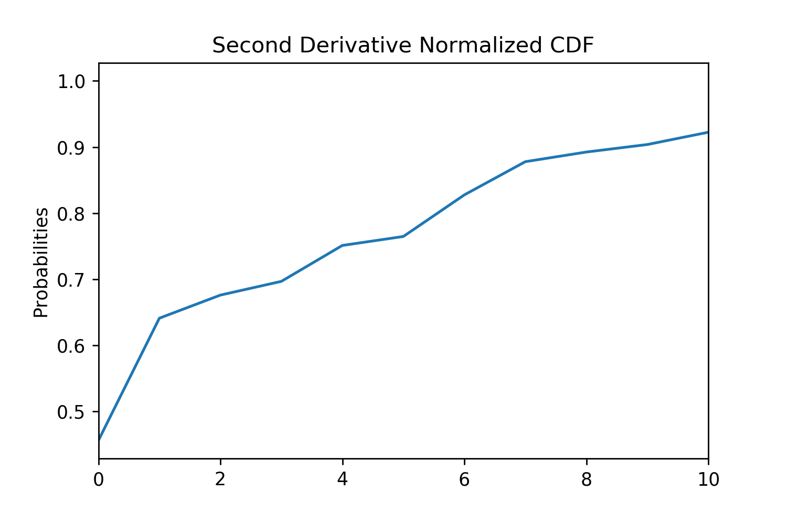{:style="width: 300px;"}

*Figure 3. Figures for the different steps of TFS and how they manipulate the probability distribution.*

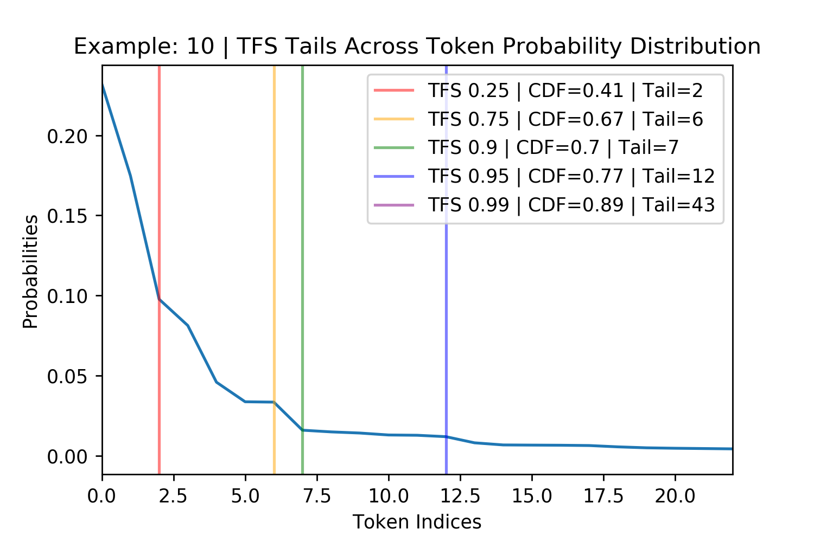{:style="width: 300px;"} {:style="width: 300px;"}

{:style="width: 300px;"} 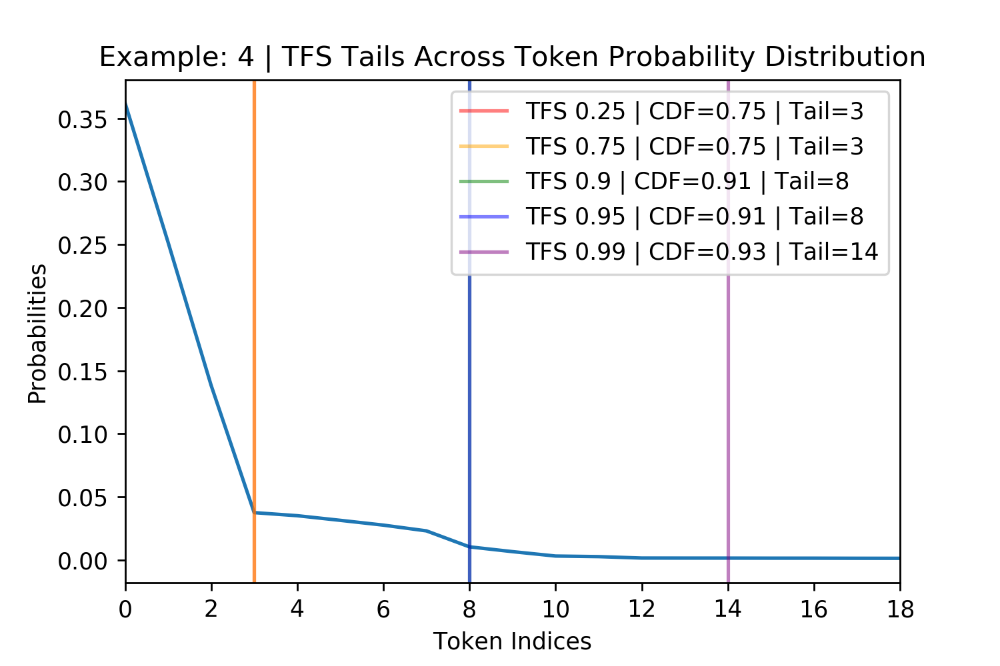{:style="width: 300px;"}

*Figure 4. Figures showing TFS finding the tail of four randomly chosen probability distributions for GPT-2. The $$z= 0.99$$ threshold does not always appear in the plot and the other thresholds sometimes overlap such as in the bottom right.*

## Experiments


*Figure 5. This figure shows sorted probabilities for tokens across 13,800 different generation points. This reveals the high variation in these distributions when given different contexts. This makes it it difficult for Nucleus Sampling to find the distribution "tail" to prune using the CDF.*

**Model Architecture** In order to validate the TFS algorithm, I used GPT-2's largest publicly available pretrained model (when this work started in July) with 345 million parameters[^gpt2] ([Radford et al. \[2019\]](https://d4mucfpksywv.cloudfront.net/better-language-models/language_models_are_unsupervised_multitask_learners.pdf)). No additional training of the model was performed.  

**Dataset** My generation tasks used the same Writing Prompts database ([Fan et al. \[2018\]](https://arxiv.org/abs/1805.04833)) as Nucleus Sampling, which was scraped from Reddit's /r/WritingPrompts channel. Posts consist of a user writing a creative story prompt such as "A man finally discovers his superpower... well into his 80's.", which other users then write short stories in response to. The dataset is presented as a pair of a prompt and human written creative story response.

**Text Generation** In order to compare the different sampling strategies, 100 prompts were randomly selected from the writing prompts test set. First, in order for none of the sampling strategies to influence the generation and probability distributions, the human written context was given to the model at each time point. In other words, the sampling strategies were analyzed without actually using them to generate completions from the prompt. GPT-2 has a vocabulary size of 50,527 and at all 150 time points for all 100 prompts, every logit was stored for analysis by the different sampling methods to see how each would prune the distribution. Eight of the prompts randomly selected did not have 150 tokens in the human completion of their stories and were removed so that each completion would be the same length, leaving 92 generations for further analysis. This resulted in 13,800 different sampling steps.

For assessment of token diversity, the same 92 prompts were used but each sampling strategy actually generated completions. This involved concatenating the story prompt and  human completion before taking the first 100 tokens of this concatenation and giving them as the starting point for GPT-2, which was then allowed to continue the story for another 150 tokens[^genlength].

**Tail Locations**
In Figure 4, above, five different TFS hyper-parameters for $$z$$, determining the CDF of the second derivative cutoff, were evaluated. These different $$z$$ values change where the tail is identified along randomly chosen token probability distributions created by the human text completion. I decided that $$z=0.95$$ is a good value for relibably finding the tail and use it for our further investigations. While Nucleus Sampling prunes the token distribution such that the CDF remaining is as close as possible to satisfying its threshold parameter $$n$$, TFS pruning produces a high variance CDF. The TFS where $$z=0.95$$ yields an average CDF threshold of 0.69 which motivated the use of Nucleus Sampling with $$p=0.69$$ as the most similar baseline.  


*Figure 6. TFS is used to find the tail of the distribution and the CDF that will remain after pruning. Histograms of 13,800 results are plotted for the different thresholds. Note how of the TFS $$z$$ thresholds has a constant CDF value.*

We first investigate the differences in the tail location and CDF retained for the TFS $$z=0.95$$ and Nucleus $$p=0.69$$, shown in Figure 7 (the next figure). Overall, $$\sim{15\%}$$ of the 13,800 sampling steps agree (this is shown as the black dotted line and can be seen most clearly in the Figure 7 left plot. These agreements are most often where the first few tokens have disproportionately large probabilities. This means that the smallest set of tokens which are greater than the Nucleus CDF threshold significantly overshoots it, resulting in tail locations which exceed its CDF threshold. This also creates a strong second derivative signal for TFS causing the TFS tail to be in the same location. In $$\sim{48\%}$$ of cases TFS has a tighter tail and CDF location (shown most clearly in the rightmost plot) with the remaining $$\sim{38\%}$$ Nucleus being tighter.

*Figure 7. The left plot shows differences in probability CDF retained by the tails found. The right shows the location values for the tails. The black dashed line is symmetric, y=x. This plot shows that the algorithms TFS and Nucleus produce quite different results.*

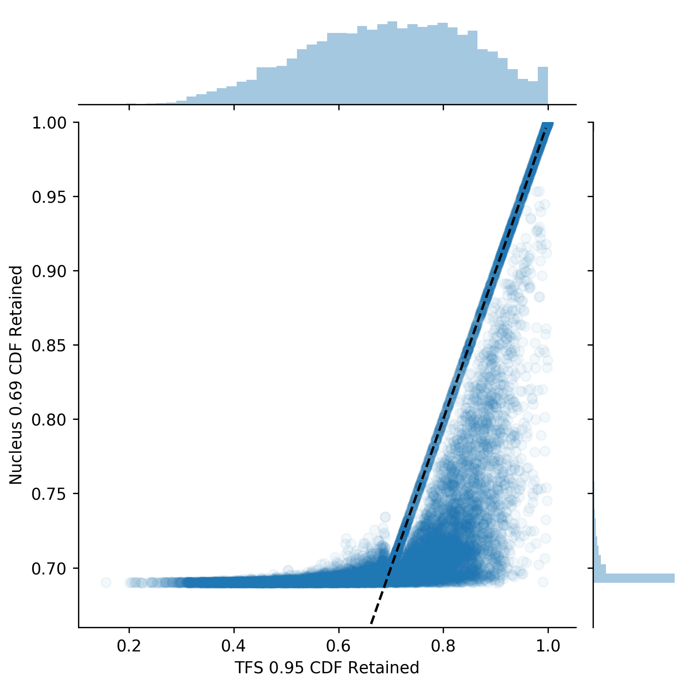{:style="width: 300px;"} 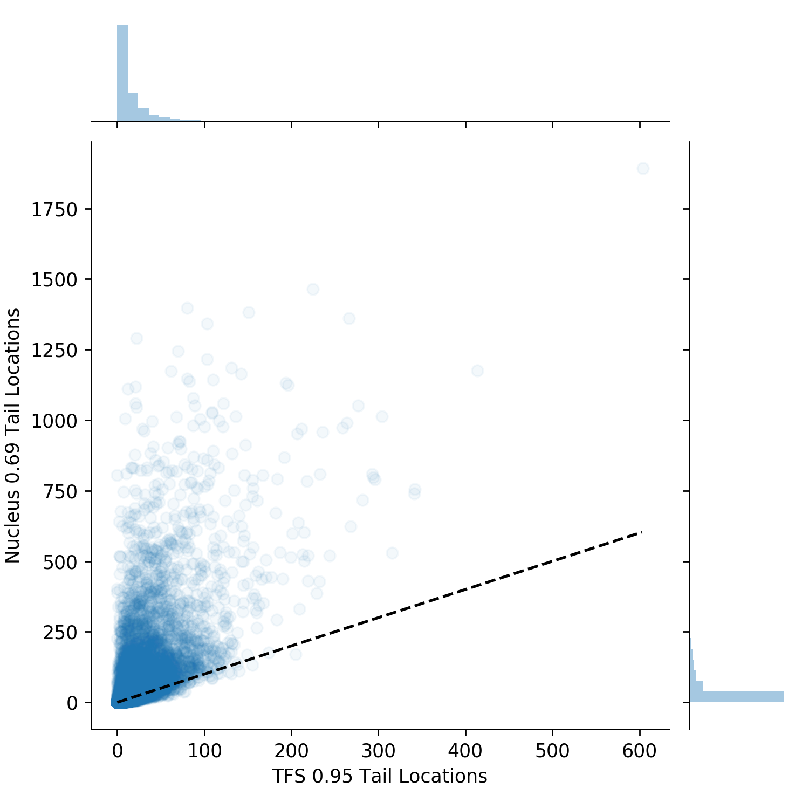{:style="width: 300px;"}

While TFS deviates from Nucleus Sampling in its tail location, this is neither good nor bad without looking at plots of exactly where each method draws its cutoff. This resulted in an investigation into cases of maximum deviation between the methods. The most extreme deviations exist in the bottom portion of the CDF plot above Figure 7, leftmost plot, where Nucleus behaves as it should with a CDF around 0.69 but TFS finds a tail that leads to a very small or large CDF. The top ten maximum deviations were located and four were randomly selected to be displayed in the below figure.

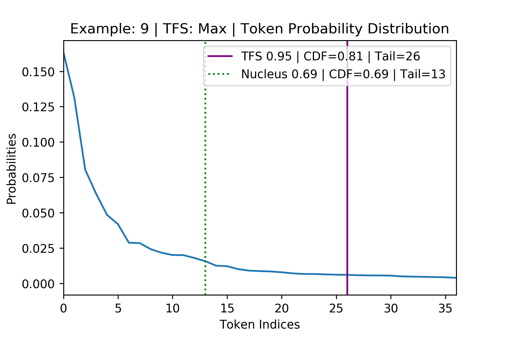{:style="width: 300px;"} 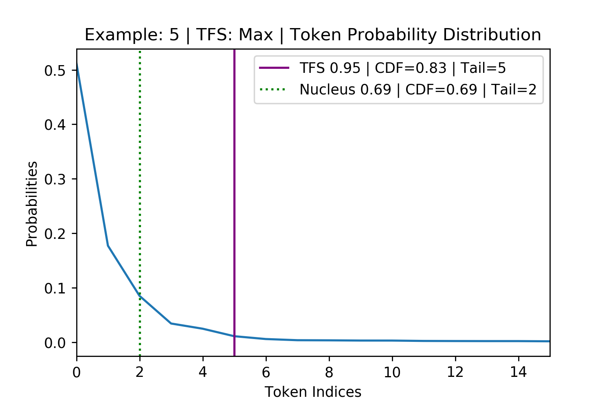{:style="width: 300px;"}

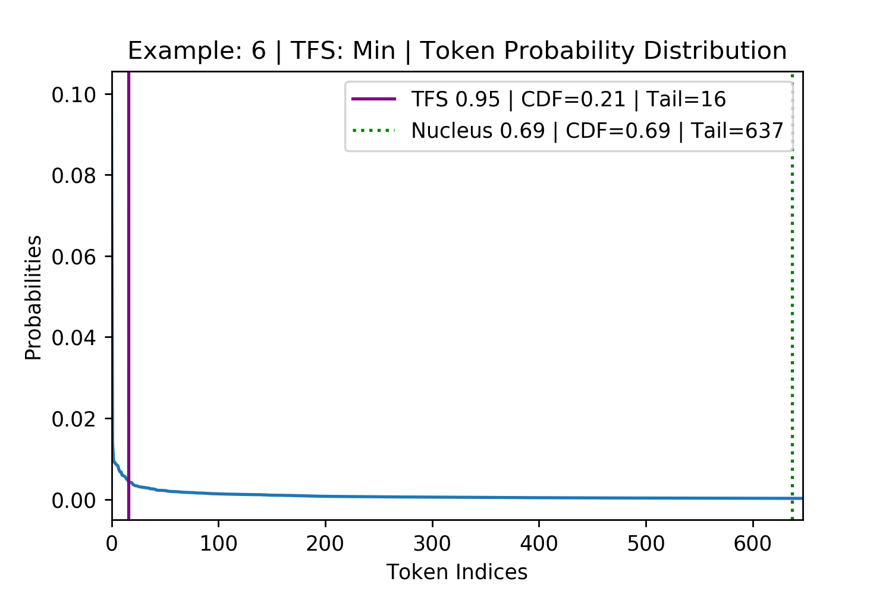{:style="width: 300px;"} 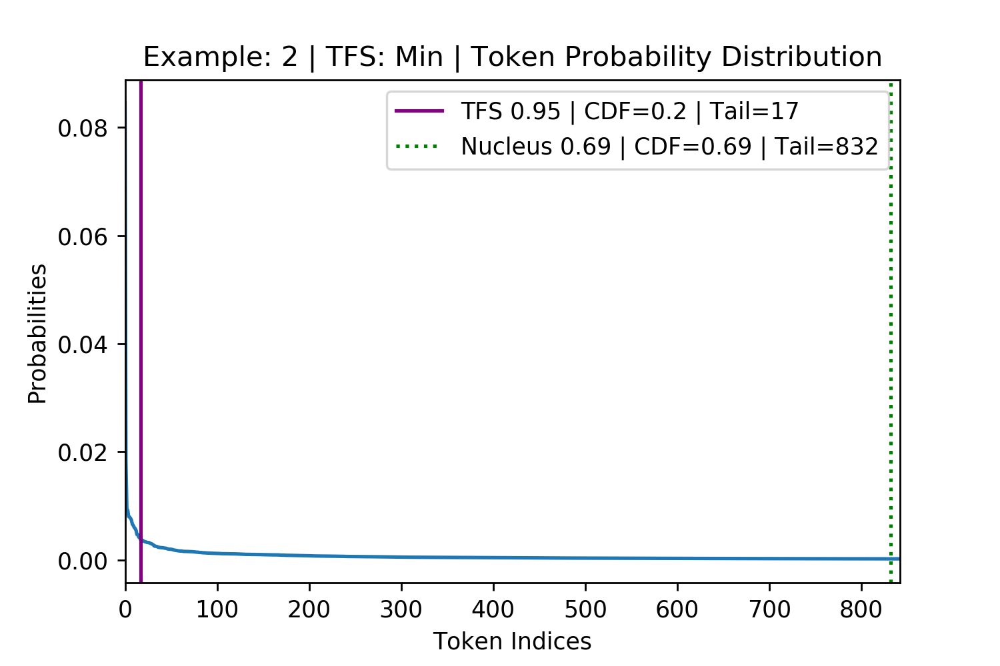{:style="width: 300px;"}

*Figure 8. Four randomly selected examples of maximum disagreement between TFS and Nucleus Sampling. The top row is where TFS had the larger CDF than Nucleus (Figure 7 leftmost plot, on the bottom right). The bottom row is where the TFS had the smaller CDF than Nucleus (Figure 7 leftmost plot, on the bottom left). These examples show that Nucleus Sampling's use of the CDF fails to generalize across different token probability distributions in finding the tail of the distribution.*

Deviations where the TFS tail is tighter than for Nucleus are particularly damaging to the generation. This is because many low probability tokens the model does not consider replaceable fail to be pruned and can potentially derail the model. As an example, for the bottom left subplot in Figure 8 (above) TFS identifies the tail at position 16 with a CDF of 0.21. Nucleus identifies the tail at 637 with a CDF of 0.69. Therefore, upon pruning, Nucleus keeps an additional 621 tokens which will represent 70% of the post-pruning, re-normalized probability mass that it samples from ($$\frac{0.69-0.21}{0.69}=0.70$$).

This analysis of the maximum deviation between Nucleus and TFS is also helpful in ruling out another sampling method that was initially considered a simpler alternative to TFS in the form of a flat probability threshold. For example, only keeping and sampling from tokens that had a larger than 2% probability. The bottom row of the above Figure 8 where both of the tails are identified to be below the 2% mark shows that such an approach would not be dynamic enough to identify the tail across different probability distributions.

**Token Diversity**
One validation method used by [Holtzman et al. \[2019\]](https://arxiv.org/abs/1904.09751) was to calculate the diversity of vocabulary used across all of the generations made by different sampling approaches in comparison to the diversity seen in the real human text completions. As can be seen in Figure 9, greedy likelihood-maximization (which is analogous to Top-K where $$k=1$$) has only a few words that are ever generated across all of its prompts which are repeated many times, contributing to larger parts of the CDF. Meanwhile, Top-K with a larger K value, TFS and Nucleus Sampling closely model the real human language distribution across all of the prompts, if anything introducing slightly too much diversity.

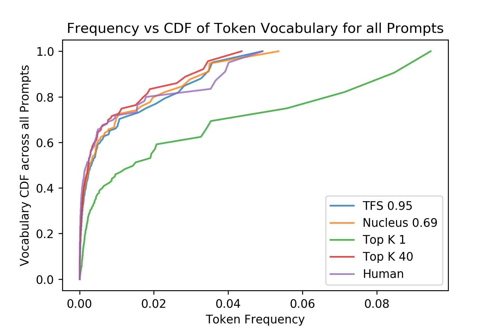
*Figure 9. Distributions of the token frequency and its contribution to the CDF.*

**Efficiency**
A potential limitation of TFS is that it is a more complex algorithm than Nucleus or Top-K sampling. The mathematical operations for both of these other sampling approaches are a subset of the TFS algorithm's operations. To evaluate differences in speed, the sampling strategies across all parameters were run for all 100 prompts with 150 tokens generated for each in batches of 25. This was replicated five times using a different random seed each time so that different prompts and tokens were selected resulting in 75,000 total tokens generated for each approach. The start and end of the batch generations of the 150 tokens was timed and compared for each method, shown in Figure 10. Combining the different sampling parameters for each of the methods, but removing Nucleus where $$p=0.5$$ because of its noise (see Appendix for times for each of the methods with different parameters not aggregated), with a t-test and $$\alpha=0.05$$ the differences in methods is statistically significant but small with the mean difference being 0.07 seconds between TFS and Nucleus. This 0.07 second difference is for for $$25*150=3750$$ generation steps which is $$0.07/3750=2/10000$$ of a second per step. One possible reason why Top-K is faster than both Nucleus and TFS by the largest margin is because there is an optimized function in TensorFlow for finding the Top-K tokens and their indices. In summary, while TFS is a more complex algorithm, needing to compute the second derivative, take its absolute value, and normalize it, these operations are shown to be highly efficient on a GPU[^gpu].

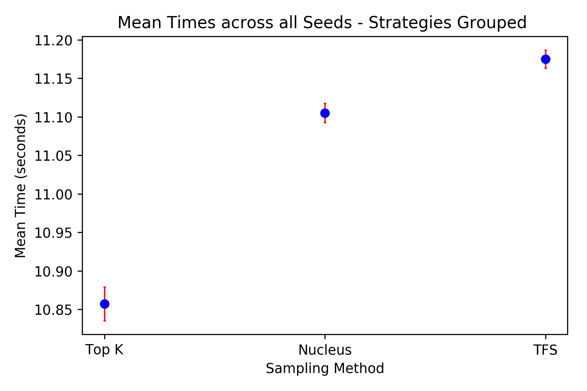
*Figure 10. Average times taken to produce a batch of 25, 150 token long generations. 95% Confidence Intervals in red.*

## Empirical Validation

The terminal goal of any language generation task is to produce text that humans rate to be of a high quality while also maintaining diversity. Human evaluation has not been performed in previous papers using open-ended sequence generation methods ([Fan et al. \[2018\]](https://arxiv.org/abs/1805.04833); [Holtzman et al. \[2019\]](https://arxiv.org/abs/1904.09751)) and we suspect this is the case for the following reason: because all of the sampling methods keep the highest probability, best tokens in their distribution, the difference is in how well they can minimize the risk of sampling a bad token. Therefore, each method attempts to raise the lower bound on generation quality, increasing the average quality of generations not by making the best possible generations better, but by avoiding bad ones.

Therefore, to show a difference in generation performance, you are required to look for bad generations rather than comparing the best ones. And because the bad tokens that should have been pruned are near the tail, these bad generations already have a low relative probability making it difficult to generate statistically significant results. (See the Appendix for a toy example of this).

TFS being superior to existing sampling methods rests upon three hypotheses:
1. Sampling from a set of replaceable tokens improves the quality and diversity of generations.
2. The trained model learns a notation of "replaceability".
3. The set of replaceable tokens can be found using TFS over other methods.

For the reason of difficulty with statistical significance, we must assume that 1 is true and set out to test 2 and 3. This hypotheses can be tested by taking tokens in front of and behind the TFS tail location at varying distances away and use humans to evaluate which of the tokens are replaceable. This would not only show that lower probability tokens are less replaceable, but also that TFS identifies the set of replaceable tokens better than other methods.

In order to test this, I crowdsourced human evaluators from Amazon Mechanical Turk. These "Turkers" were tasked with rating how reasonable each of seven different words were to fill in the blank on a scale of 1 (extremely unreasonable) to 5 (extremely reasonable) for a given context.

Random questions from the Reddit r/WritingPrompts dataset were selected along with a random position in each of their human completions. All of the text up to this point was fed into GPT-2[^biggerGPT2] and the probability distributions for what the next token should be were stored. From this probability distribution, the highest probability token was kept and five other tokens with linear spacing from the highest probability to a probability of ~0. For example, if the highest probability is 60% then the other probabilities would be 50%, 40%, 30%, 20%, 10% and 0% with the tokens closest to these kept. These six tokens and the original ground truth token the human wrote as the real completion were randomly shuffled before being presented to the Turkers with 15 tokens of context in front[^bytepair].

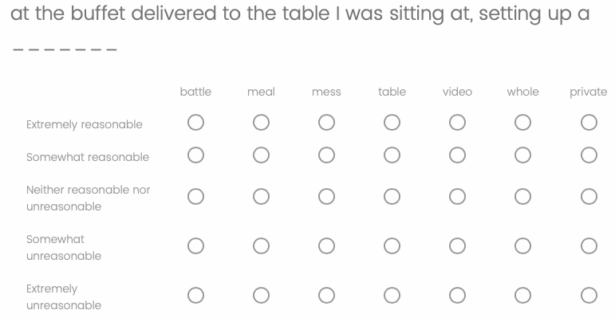
*Figure 11. An example screenshot of a question the Turker would be asked to complete.*

Including the real, ground truth completion word was useful for quality control in two ways. Firstly, there were cases where the highest probability GPT-2 token and the ground truth token were the same, meaning two of the seven words to score were duplicates. Users were warned about the presence of duplicates and to give them the same score. If they did not, this was strong evidence they were not paying attention and were failing to be internally consistent, resulting in their answers being ignored. Secondly, the ground truth words should be recieved scores on average somewhere in extremely reasonable to somewhat resonable, consistently giving very low scores to these words another red flag for quality and also resulted in removal from the dataset.

Across 35 different randomly chosen contexts, I collected 65 responses from different evaluators, of which 33 cleared the aforementioned quality control barriers. This resulted in 210 words getting a total of 2190 different ratings (not all of the contexts got the same number of responses as they were done in batches). This cost a total of $48.20.

I hoped to first validate the relationship between GPT-2 probability and token replaceability. Then, having real data on replaceability of different words, to show that the point at which TFS wanted to prune was closer to the point at which the words were no longer replaceable while this was not the case for Nucleus.

Validating the overall relationship between GPT-2 probability and token replaceability was a success.

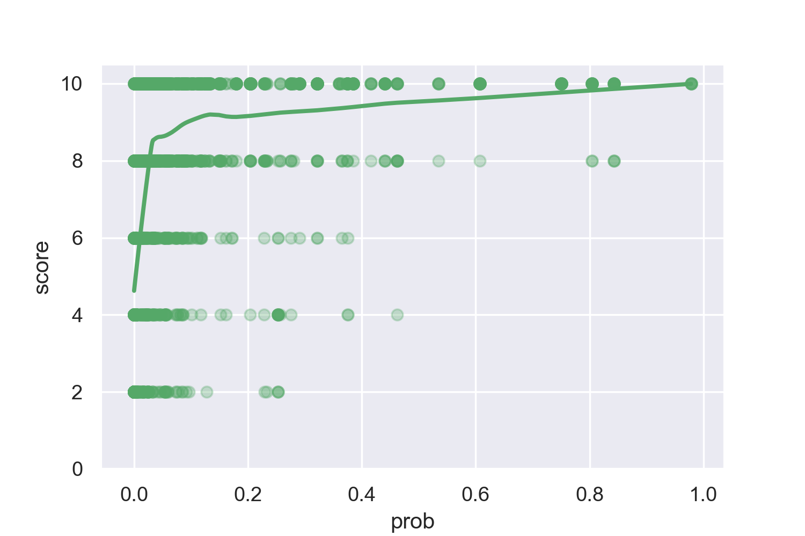{:style="width: 300px;"} 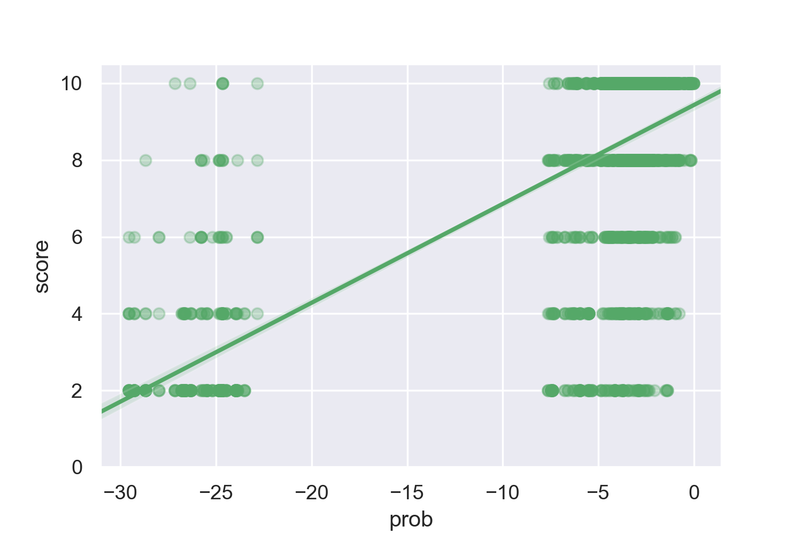{:style="width: 300px;"}

*Figure 12. Plots of the relationship between GPT-2 token probability and score from 1 - 10 (the scores from 1 to 5 were multiplied by 2). On the left is a LOWESS plot. On the right is a robust regression where the probabilities are logarithmic. This regression has an R^2 of 0.41*

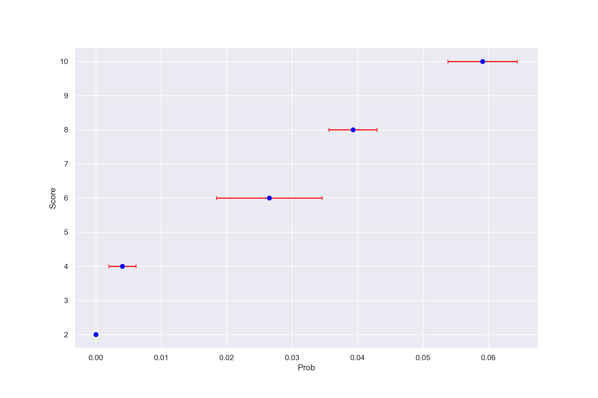
*Figure 13. Taking the median probabilty for each score and bootstraping their 95% confidence intervals. There are similar results for taking the mean.*

However, when looking at individual samples and answers there was too much noise and not enough tokens tested to be able to draw any conclusions on whether or not Nucleus or TFS was better.

*Figure 14. Examples where the probabilities don't have a positive relationship to the scores given. The median score for each word was taken and 95% confidence intervals were bootstrapped.*

.png)

.png)

.png)

*Figure 15. Examples where the linearly spaced probability gaps the tokens were selected using are not informative enough. In these cases, the 2nd lowest probability is rated replaceable while the lowest is rated completely non-replaceable. This means leaves the transition point between replaceable and non-replaceable unresolved.*

.png)

.png)

.png)

Alas, this is where I am currently stuck. I am very interested to hear ideas for how to better validate these sampling methods, something that to my knowledge has not been done before.

## Conclusion

In this blog post I have described the motivations for and results of a new method to perform open-ended generation of sequences from an autoregressive model. I argue that by explicitly finding the plateau in probabilities assigned to tokens, we are able to capture the point at which our model no longer considers them replaceable. Moreover, because of the fundamental replaceability of words, sampling from this set of replaceable tokens corresponds to diverse and high quality generations.  Hopefully, through collaboration, I will be able to find effective ways to better empirically validate these hypotheses.

However, in the meantime, because neither Top-K or Nucleus Sampling have been empirically validated, researchers performing open-ended generation tasks should consider using Tail Free Sampling. This is because of its theoretical motivation in the replaceability of words and greater interpretability.

## Citation

This research and code has no license. However, if you found it useful please cite this post:
```
@misc{TailFreeSampling-Bricken-2019,
  title={TailFreeSampling},
  url={https://www.trentonbricken.com/Tail-Free-Sampling/},
  journal={trentonbricken.com},
  author={Trenton Bricken},
  year={2019}, month={Nov}}
```

### Footnotes
* footnotes will be placed here. This line is necessary
{:footnotes}

### Acknowledgements

I would like to thank Dr. David Banks, Miles Turpin, Nathan Rollins, Dr. Debora Marks, Alexander Bricken and Gwern Branwen without whose feedback, support, or inspiration this work would not have happened.

I would also like to thank all opensource contributors whose work has been invaluable. This includes but is not limited to: [Numpy](https://numpy.org); [Pandas](https://pandas.pydata.org); [SciPy](https://www.scipy.org); [Matplotlib](https://matplotlib.org); [Seaborn](https://seaborn.pydata.org); [Tensorflow](https://www.tensorflow.org); [Anaconda](https://www.anaconda.com/distribution/); [Jupyter Notebooks](https://jupyter.org)

Funding for this project was provided indirectly through my parents; the Robertson Scholars Leadership Program; and the Google Cloud Platform's free trial credits.


## Appendix

### Differences in Run Time

*Average times taken to produce a batch of 25, 150 token long generations separated out by the different sampling strategies and different parameters used. It can be seen that Nucleus $$p=0.5$$ is particularly noisy, hence being left out for the significance testing.*

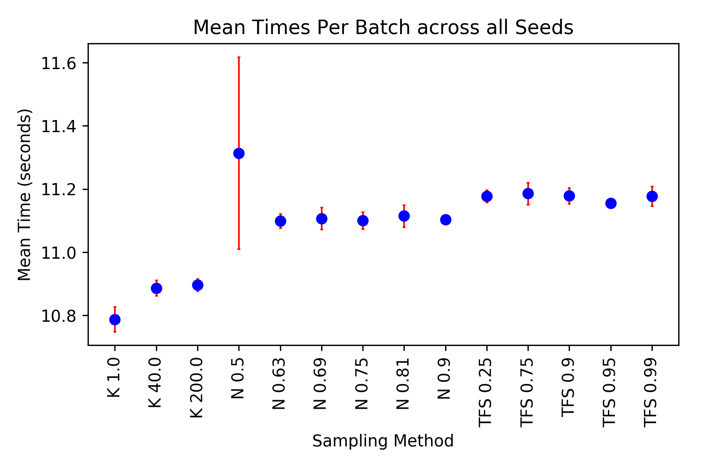


### Empirical Validation Statistical Significance

Given sampling methods A and B, we want to learn which one is superior by generating examples from both of them and seeing on average which one produces higher quality generations.

We can model this problem as the flipping of two biased coins. We let the probability the coin lands tails represent the probability of sampling a low probability token which ruins the generation.

If both coins land heads (don't sample low probability tokens that are not replaceable) then comparing the generations will produce random noise. Because of the stochastic nature of sampling one of the generations is likely to be better than the other.

If both coins land tails, they both have terrible outputs, and the evaluation that one generation is better that the other will also produce random noise.

Only if one of the coins lands heads and the other tails will we be able to honestly evaluate which model produced a good or bad output, giving us a real signal.

Running simulations under these assumptions for different probabilities of coins A and B landing on tails produces the following results:

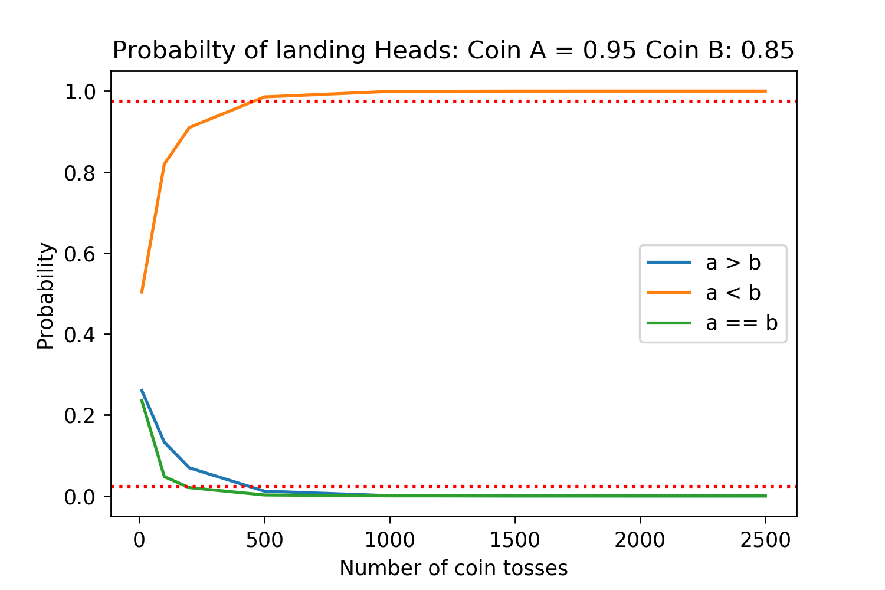

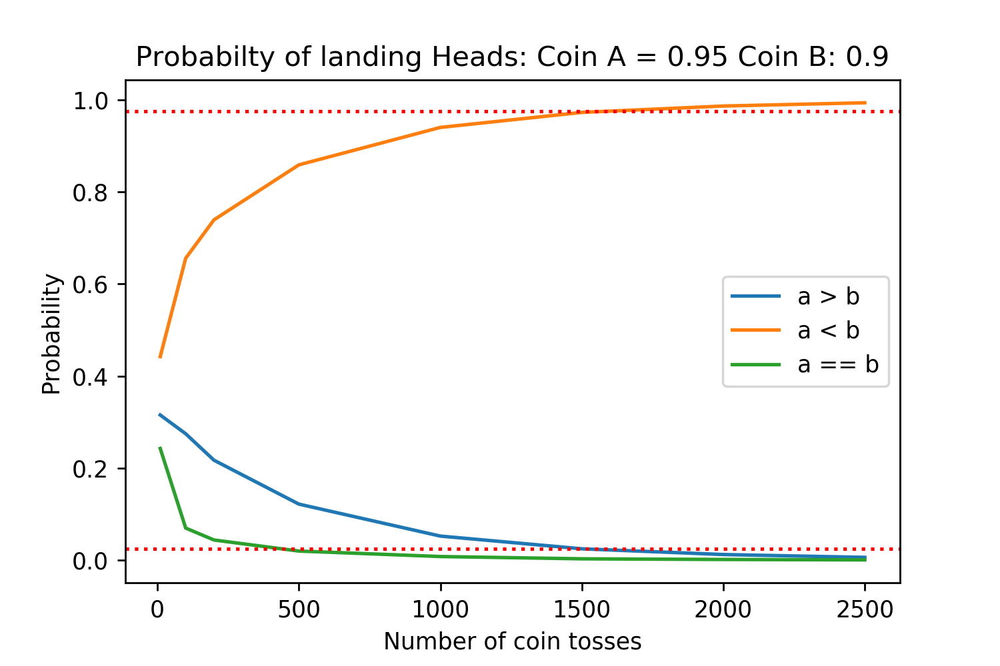

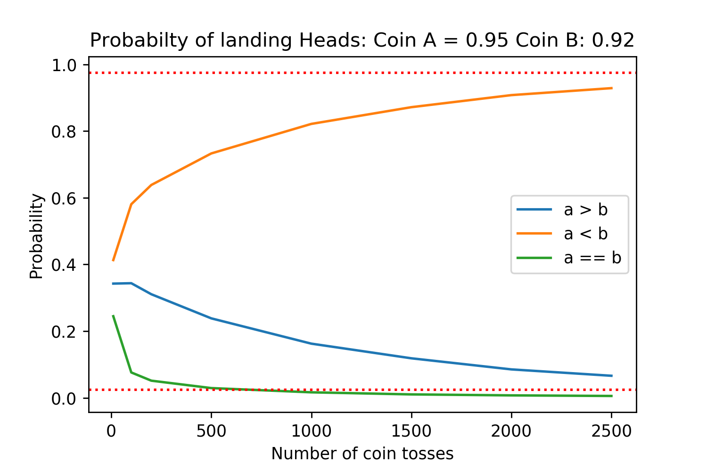

*The red dotted lines are the 2.5% and 97.5% lines, corresponding to statistical significance for a two sided t-test with $$\alpha=0.05$$. Each of the different number of coin tosses was simulated 50,000 times for high accuracy.*

We can see that even if method A has a 10% reduction in the probability of sampling a tails (95% heads vs 85% heads), we need at least 500 generations to be evaluated in order to get a statistically significant result.

And this is assuming that for a comparison between generations the human evaluators always agree on which is better. Between there being evaluators who are not paying attention, the generated passages being at least a few sentences long, and different evaluators simply having differences in stylistic preference for which is "better" there will be noise in the decision. Therefore, even for the case where we need at least 500 generations evaluated, each generation may need anywhere from three to ten people to have a robust result for it.

### Algorithms related to TFS

Only after developing the TFS algorithm, did existing algorithms to find the "knee" of a probability distribution come to my attention. These algorithms have already been used in "scree" plots for finding the point of diminishing returns in the number of principle components to use for PCA.

As a result, I tested the seemingly most popular  of these algorithms: Kneedle, but found that it did not perform well for the more complex and rugged probability distributions of tokens, tending to draw the tail long after the probabilities has plateaued and independent of the hyperparameter, not able to draw the tail point any closer ([Satopaa et al. \[Date Not Given\]](https://raghavan.usc.edu/papers/kneedle-simplex11.pdf)).

*Only the TFS value of $$z=0.95$$ was compared to Kneedle across a range of different hyperparameter values. Note how many of the Kneedle points are out of the bounds of the plot (limited to a max index of 30) and how none of the smallest Kneedle parameter values drop significantly below a particular threshold. Therefore, TFS offers much more flexibility and tighter pruning of potentially bad tokens.*

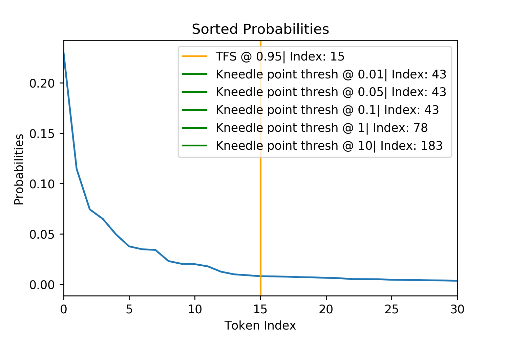{:style="width: 300px;"} 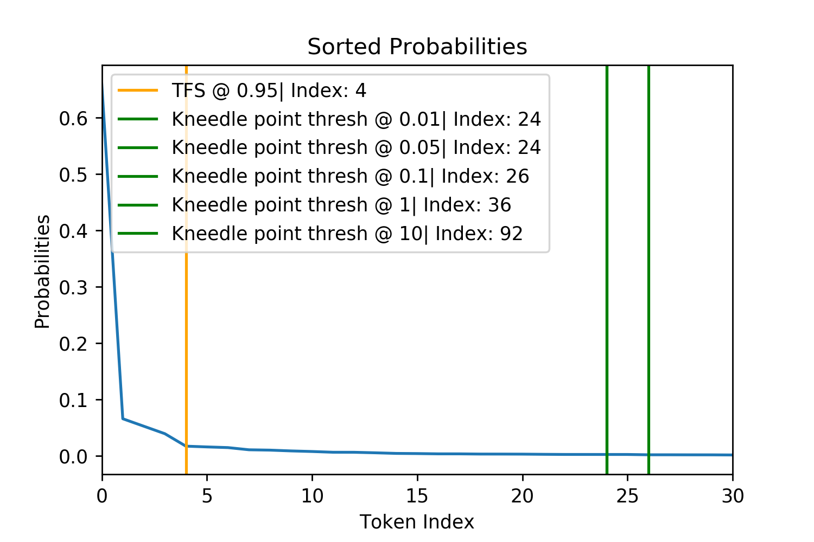{:style="width: 300px;"}


[^autoreg]: This is particularly the case for auto-regressive models where a different token selected early on alters the conditional probability and every token sampled later.

[^lemmas]: A lemma is defined as an: "uninflected word from which all inflected words are derived" and also excludes proper nouns eg. the names of locations ([Brysbaert et al. \[2016\]](https://www.frontiersin.org/articles/10.3389/fpsyg.2016.01116/full)).

[^bioparallel]: Interestingly, this is also true of biology in the case of protein sequences and codons ([Lagerkvist \[1978\]](https://www.pnas.org/content/75/4/1759)). In the protein case, each of the 20 amino acids used to make our natural proteins are unique but they cluster in terms of their chemical properties making a subset replaceable with each other ([Henikoff and Henikoff \[1992\]](https://www.ncbi.nlm.nih.gov/pubmed/1438297)).

[^gpt2]: Only the largest model of [Radford et al. \[2019\]](https://d4mucfpksywv.cloudfront.net/better-language-models/language_models_are_unsupervised_multitask_learners.pdf) with 1.5 billion parameters is officially called GPT-2, however for convenience the GPT 345M model will be referred to as GPT-2 for the rest of the paper.

[^genlength]: These prompt and generation lengths are similar to those in other open-endeed generation papers ([Fan et al. \[2018\]](https://arxiv.org/abs/1805.04833); [Zellers et al. \[2019\]](https://arxiv.org/abs/1905.12616)).

[^gpu]: A single NVIDIA T4 GPU was used for all experimentation.

[^biggerGPT2]: During work on this section, OpenAI released the 774 million parameter model which was used to make the highest quality probability distributions for TFS, Nucleus and Top-K sampling.

[^bytepair]: GPT-2's vocabulary consists of byte-pair encodings where certain tokens represent complete words and others represent only parts of words ([Radford et al. \[2019\]](https://d4mucfpksywv.cloudfront.net/better-language-models/language_models_are_unsupervised_multitask_learners.pdf)). This means that some selected tokens are not complete words which can bias the human evaluation of replaceability. As a result, I first removed all tokens that were not words before finding the word with the closest probability.
