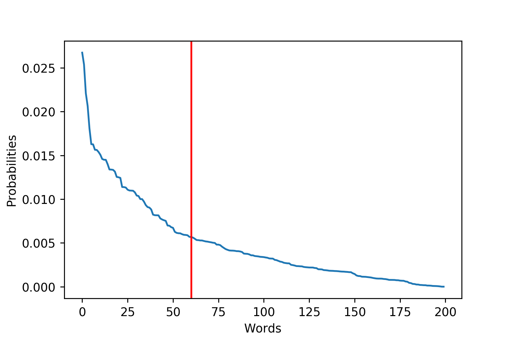
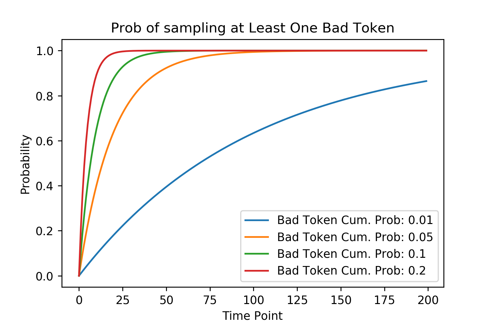
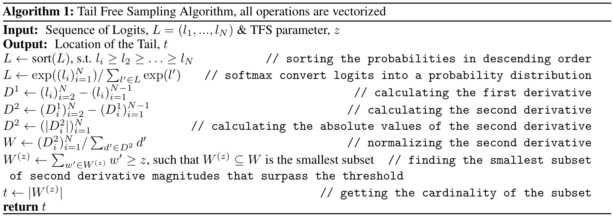
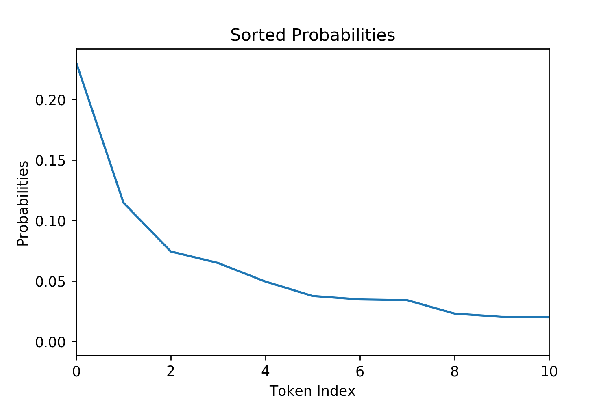
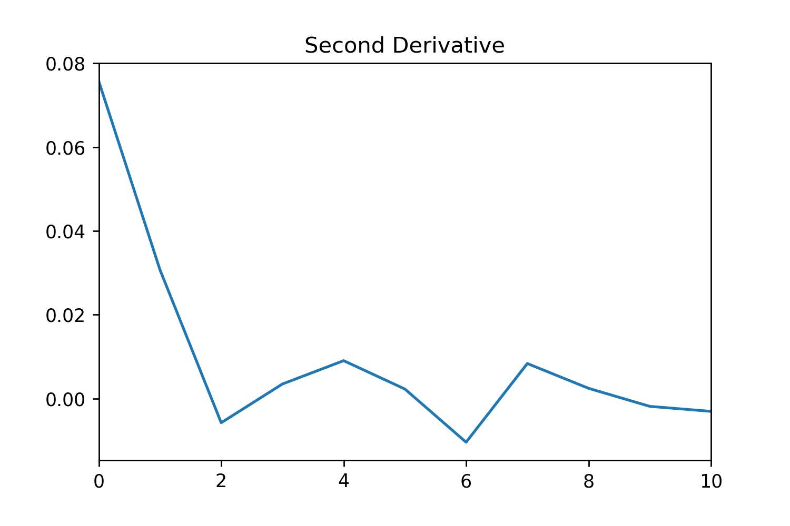
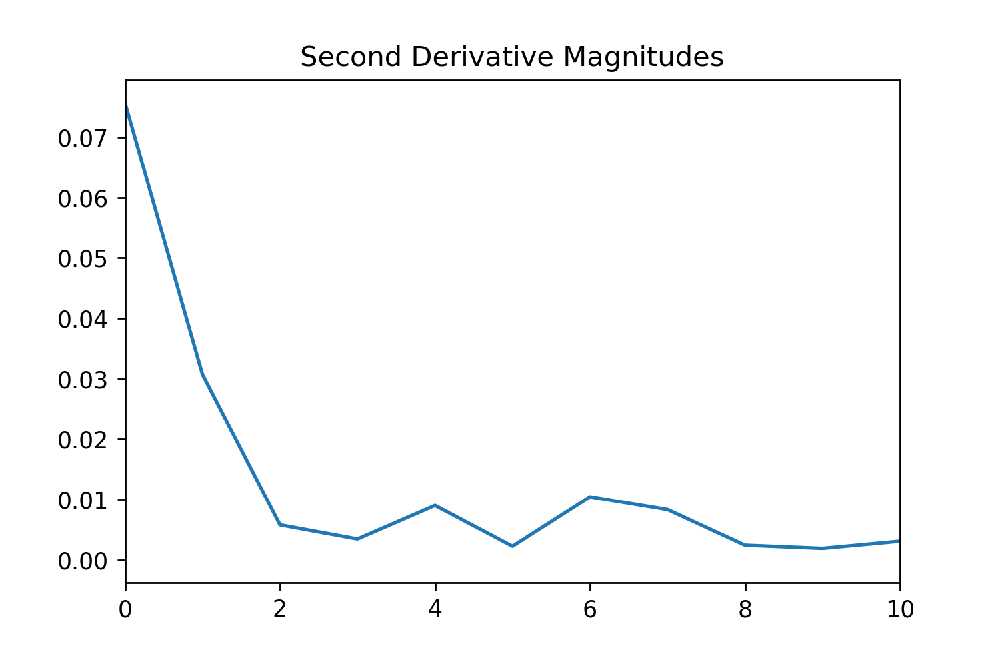
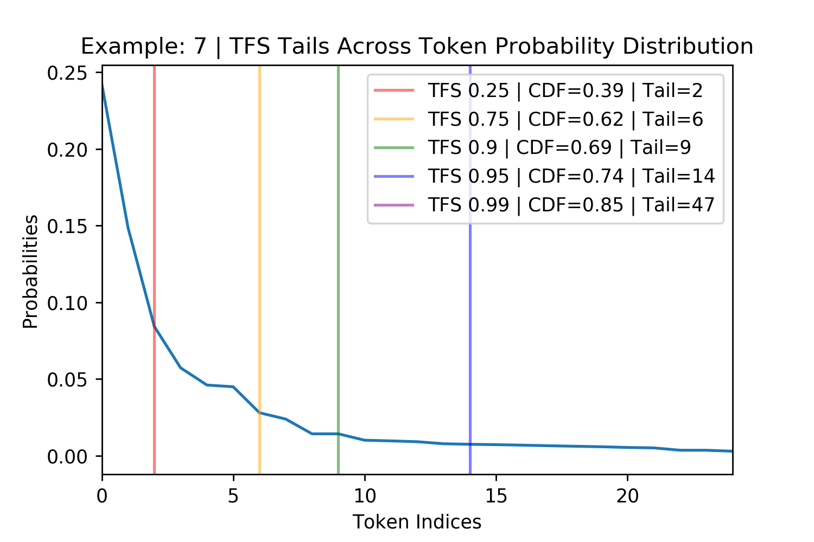
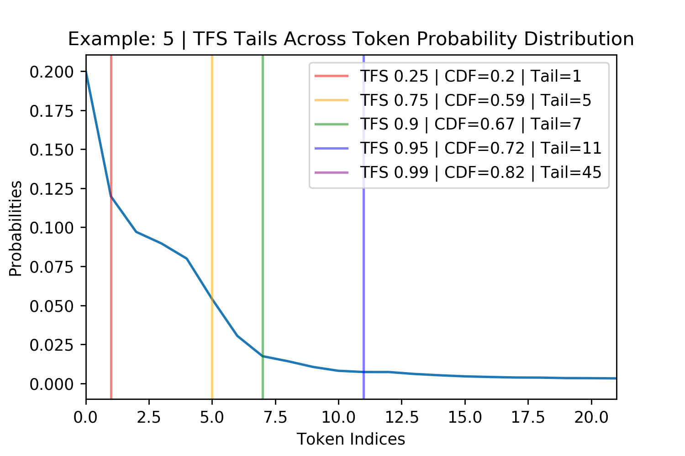
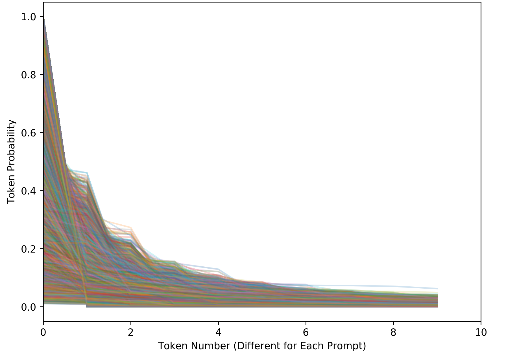
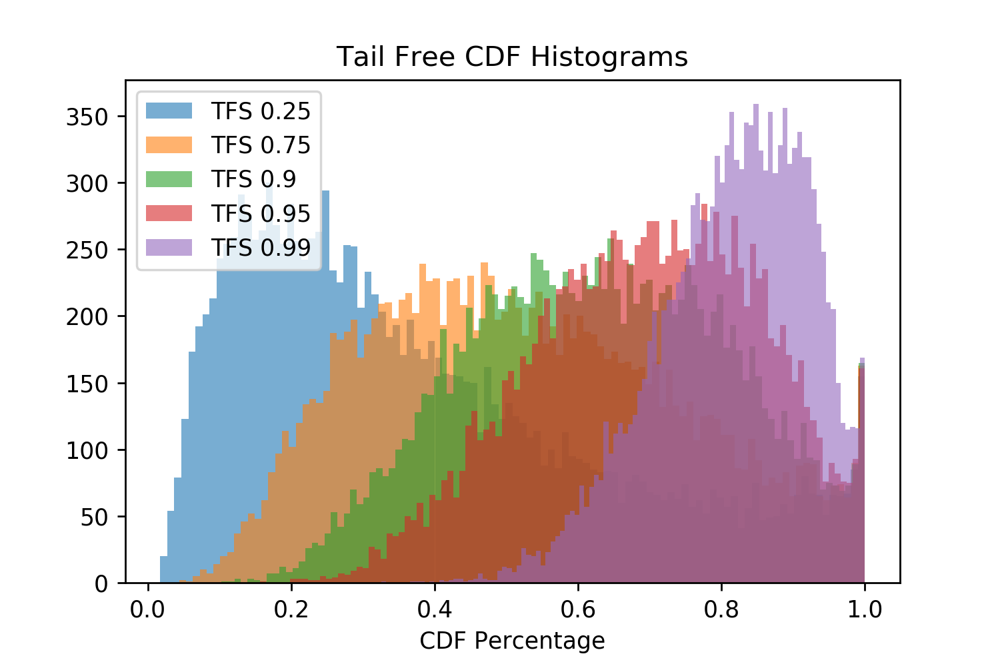

With the increasing ability for neural networks to model natural language accurately, there are a growing number of applications for open-ended neural generation tasks. Yet, recent efforts in open-ended generation continue to present questions as to why likelihood-maximization methods such as greedy search produce degenerate outputs. This issue, and the natural replaceability of words, motivates the use of stochastic, sampling based approaches. However, sampling in a way that generates both high quality and diverse outputs remains a non-trivial problem.

As a result, I have developed Tail Free Sampling, a new sampling method that I argue is more theoretically sound than the existing sampling approaches: Top-K and Nucleus ([Fan et al. \[2018\]](https://arxiv.org/abs/1805.04833); [Holtzman et al. \[2019\]](https://arxiv.org/abs/1904.09751)). It also requires less hyperparameter tuning and the hyperparameter generalizes better across language generation domains.

This blog post provides: 
1. A summary of the problem of open-ended generation and motivation behind Tail Free Sampling
2. Background on previous approaches
3. The Tail Free Sampling algorithm
4. Comparisons between Tail Free Sampling, Top-K, and Nucleus Sampling
5. Attempts at empirical validation of Tail Free Sampling to show it produces superior results. 

This project is currently stuck at the empirical validation stage. The reasons and my attempts to solve it are outlined at length in Section 5. However, the underlying source of difficulty is that sampling methods improve the quality of the average generation not by increasing the quality of the very best generations, but raising the quality of the worst. I would be very interested in collaborating with anyone who has ideas for how to validate different open-ended generation sampling methods, to my knowledge this is something that has not been done in any paper utilizing Top-K or Nucleus sampling.

## Summary

Say you're an avid Dungeons and Dragons (D&D) player and have trained an autoregressive neural network on lots of existing examples of D&D adventures. You now want to use machine learning to generate new adventures that have never existed before. 

How do you generate new text from the trained model? This turns out to be a difficult problem. For close-ended generations, where the length of the output is predictable from the input, likelihood-maximization strategies such as greedy search and beam search perform well. Examples of close-ended generation include image captioning and machine translation. 

However, for something like D&D adventures, which can be of very different lengths, there is no clear point at which a generation should stop, thus making it "open-ended". 
Trying to use likelihood-maximization strategies to approximate the highest probability generations currently fails, resulting in highly repetitive and nonsensical outputs.

As a result, sampling strategies must be used to create diversity. But, we can't sample from the whole distribution of words because this risks derailing the model by sampling low probability words. Therefore, sampling must be constrained to a promising subset of high probability words. But what is the correct trade-off between sampling enough words to create diversity and not too many to retain quality?

Initially, the solution to this problem was Top-K sampling ([Fan et al. \[2018\]](https://arxiv.org/abs/1805.04833)). At every point in a sequence generation, all but the top K probability words are removed, the remaining K words' probabilities are re-normalized, and then sampled from. This K is fixed for every single generation step. 

Top-K has worked fairly well with a K value of 40 being common ([Radford et al. \[2019\]](https://d4mucfpksywv.cloudfront.net/better-language-models/language_models_are_unsupervised_multitask_learners.pdf)). However, a problem with this approach, realized by [Holtzman et al. \[2019\]](https://arxiv.org/abs/1904.09751), is that in different contexts there will be fewer or more words that should be considered and sampled from. For example, the sentence "the cat sat on the \_\_\_\_" has only a few very high probability words to fill in the blank like "mat". Meanwhile, "I ate the _____" could be any possible food item, meaning more words should be considered and sampled from. Rather than keeping the same fixed K words, the number kept should be in proportion to their probability distribution.

See the plots below for examples of more uniform and exponential probability distributions over the words. I plotted red lines to try and emphasize where the tails of the distributions may be. This is trying to emphasize that for different distributions there are more or fewer reasonable words: 

{:style="width: 300px;"} {:style="width: 300px;"}

This motivated Nucleus sampling, which dynamically changes the number of words to prune by using the cumulative distribution function (CDF) of the word probabilities ([Holtzman et al. \[2019\]](https://arxiv.org/abs/1904.09751)). The hyperparameter n must be set as a threshold for this CDF.

I argue that Nucleus sampling, while clever in dynamically updating the cut off threshold, fails to explicitly capture what we want: the point at which the next words consider no longer becomes "replaceable", which is revealed by the the probabilities plateauing. 

Tail Free Sampling finds this point of plateau explicitly by using the second derivative of the probability distribution rather than its CDF to more accurately find the "tail" of the distribution. Because the point of plateau isn't precisely defined, Tail Free Sampling still relies on a hyperparameter but it is far more context robust, consistently finding the tail of the distribution while Nucleus sampling can over or undershoot this depending on the shape of a particular CDF. 

## Background

### The Problem of Maximization

Current likelihood-maximizing strategies such as greedy and beam search failing in the domain of open-ended generation, by producing short, highly repetitive outputs, has led to many questions, investigations, and possible explanations ([Holtzman et al. \[2019\]](https://arxiv.org/abs/1904.09751); [Hashimoto et al. \[2019\]](https://www.aclweb.org/anthology/N19-1169/); [Radford et al. \[2019\]](https://d4mucfpksywv.cloudfront.net/better-language-models/language_models_are_unsupervised_multitask_learners.pdf);[Murray and Chiang \[2018\]](https://arxiv.org/abs/1808.10006); [Welleck et al. \[2019\]](https://arxiv.org/abs/1908.04319)). These possible explanations have included: 
1. In order to maximize information density, surprising and less predictable words are used with a high frequency to avoid saying what is predictable, making language inherently hard to predict ([Holtzman et al. \[2019\]](https://arxiv.org/abs/1904.09751); [Grice \[1975\]](https://www.ucl.ac.uk/ls/studypacks/Grice-Logic.pdf)); 
2. Models over-fitting to the training data ([Hashimoto et al. \[2019\]](https://www.aclweb.org/anthology/N19-1169/));
3. Likelihood-maximization choosing avenues down the tree of possible generations that are dead-ends with the resulting lowest entropy ([Murray and Chiang \[2018\]](https://arxiv.org/abs/1808.10006)); 
4. The cross-entropy loss lacking a term to penalize high probabilities assigned to previously generated tokens ([Welleck et al. \[2019\]](https://arxiv.org/abs/1908.04319)).

### The Promise of Sampling

It is likely, and in some cases already shown, that these ideas contribute to the degeneracy of likelihood-maximization strategies with [Welleck et al. \[2019\]](https://arxiv.org/abs/1908.04319)’s new cost function appearing particularly promising. However, one solution that addresses a number of issues with creating diverse, high quality generations is sampling. In the domain of producing natural human language, there are often a large number of options at both the word and sentence level that convey similar meaning[^bioparallel] this motivates sampling from a set of replaceable words, rather than choosing only the best. 

In addition to being theoretically sound, sampling methods are one of the most promising approaches to ensuring that generations are diverse.  These produce diversity in two ways:
1. Generated outputs are independent from, or onlyweakly correlated to, other outputs because of their stochastic nature3. This is a problem with likelihood-maximizationstrategies that many have tried to address ([Ippolito et al. \[2019\]](https://arxiv.org/abs/1906.06362); [Vijayakumar et al. \[2016\]](https://arxiv.org/abs/1610.02424); [Kulikov et al. \[2018\]](https://arxiv.org/abs/1811.00907)); 
2. Sampling produces diversity in the sense of deviating from the highest probability regions of the model. [Hashimoto et al. \[2019\]](https://www.aclweb.org/anthology/N19-1169/) acknowledges the trade-off between generating high quality sequences that are from high probability regions but may be a consequence of over-fitting, and producing novel sequences that represent more distant regions of probability space that can lose their quality as a result. This problem can be seen as an example of the ubiquitous explore exploit trade-off.

### Dangers of Derailing
It has been estimated that the "average 20-year-old native speaker of American English knows 42,000 lemmas"[^lemmas] ([Brysbaert et al. [2016]](https://www.frontiersin.org/articles/10.3389/fpsyg.2016.01116/full)). While we have large vocabularies, our neural architecture seems to very efficiently prune the large majority of words in our vocabulary from our conscious consideration in a given context so that only a few, replaceable words, are considered. Similarly, neural networks have a vocabulary of tokens that they can use to generate outputs from. While they output probabilities to all of their tokens, words which are not replaceable need to be pruned to guarentee a high quality output. As shown in Equation 1, the probability of sampling at least one bad token and derailing a model across a sequence generation is exponential (see also Figure 1). A single bad token can ruin a generative output. However, it is particularly damaging for an auto-regressive model because it can derail the generation of every later token conditioned upon this bad one. 

$$P(\text{Derailed})=1-P(\text{Good Token Sampled})^{\text{Num Sampling Steps}}$$

*Each line represents a different cumulative probability that a bad token is sampled (the part of the distribution that should be pruned).*

## Current Sampling By Pruning Methods

Having already given the high level motivations behind the different existing sampling algorithms, we briefly re-state and show them mathematically here: 

Top-K Sampling prunes the vocabulary by taking the highest K probability words from the distribution, then normalizing, and then sampling. This can be represented by maximizing the equation: 

$$\sum_{x \in V^{(k)}} p_\theta(x|x_{<t})$$ 

where $$x$$ is a vector of all tokens in the vocabulary, $$p_\theta$$ is the probability distribution over the tokens in the vocabulary, parameterized by $$\theta$$, $$x_{<t}$$ is the context given for the current generation step, $$V$$ is the vocabulary and $$V^{(k)}$$ is the subset of size $$k$$ of tokens.

Nucleus sampling realized that in different contexts there will be fewer or more tokens that are replaceable. As a result it dynamically changes the pruning location by using the CDF of the token probability distribution. This is achieved by finding the smallest subset of $$x$$ tokens that satisfy the equation: 

$$\sum_{x \in V^{(p)}}p_\theta(x|x_{<t})\ge p$$ 

where $$p \in [0,1]$$ is the probability parameter and $$V^{(p)}$$ is the smallest subset of $$V$$.

Another final approach that doesn't involve explicitly pruning words but tries to achieve the same effect is by using temperature. This is applied as outputs of the model (often called logits) are converted into probabilities using the softmax equation:

$$p(x) = \frac{\exp(x/t)}{\sum_{x \in V}(\exp{(x/t)})}$$ 

where $$t$$ is the temperature. Temperature serves to increase or decrease the relative probabilities of tokens. However, the temperature walks a fine line between being low enough that non-replaceable tokens are given such low probabilities they no longer threaten to derail the model and maintaining high enough diversity to not become approximately greedy.

There are two reasons that temperature sampling is not further investigated in this paper:
1. It is not mutually exclusive to the other pruning methods and could be applied either before, after, or before and after a sampling method that prunes; 
2. Applying a temperature alters the relative probability of the tokens, changing the location of the tail and any signal for where the model considers tokens replaceable. 

As a result, I propose that only if the model used to produce the probability distributions is assigning probabilities across its tokens in a consistently biased way should temperature be applied in addition to one of the pruning methods to correct this. 

## Tail Free Sampling Algorithm

The Tail Free Sampling algorithm is shown formally and also described step by step here. We then look at comparisons between it, Top-K and Nucleus sampling. 

TFS first converts logits output by a model into probabilities using the softmax function before sorting them in descending order. It then calculates the first and second derivatives. As the tokens are discrete, this can be found with subtraction. The magnitude of each second derivative is then taken and normalized so that they sum to 1. Finally, a threshold z is used to determine what part of the cumulative distribution of the second derivative weights to define the "tail" of the distribution to be at. This is a hyper-parameter that can be tuned. However, as we show later, there is lower variance in the effects of this hyper-parameter than for Nucleus sampling and empirically values ranging from 90% - 99% work well at reliably finding the last drop in the probability distribution before it plateaus. After running the algorithm, the tokens above the tail location that remain are re-normalized and sampled from.

*Below are some figures for the different steps of tail free sampling and how they manipulate the probability distribution:* 

{:style="width: 300px;"} {:style="width: 300px;"}

{:style="width: 300px;"} {:style="width: 300px;"}

*Below are figures show Tail Free Sampling finding the tail of four randomly chosen probability distributions for GPT-2. The $$z= 0.99$$ threshold does not always appear in the plot and the other thresholds sometimes overlap such as in the bottom right.*

{:style="width: 300px;"} {:style="width: 300px;"}

{:style="width: 300px;"} {:style="width: 300px;"}

## Experiments

*The below figure shows sorted probabilities for different tokens across 13,800 different generation points showing the high variation in these distributions given different contexts. This makes it it difficult for Nucleus sampling to find the distribution "tail" to prune using the CDF.*

**Model Architecture** In order to validate the TFS algorithm, we used GPT-2's largest publicly available pretrained model (when this work started in July) with 345 million parameters[^gpt2] ([Radford et al. \[2019\]](https://d4mucfpksywv.cloudfront.net/better-language-models/language_models_are_unsupervised_multitask_learners.pdf)). No additional training of the model was performed.  

**Dataset** Our generation tasks used the same Writing Prompts database ([Fan et al. \[2018\]](https://arxiv.org/abs/1805.04833)) as Nucleus sampling, which was scraped from Reddit's /r/WritingPrompts channel. Posts consist of a user writing a creative story prompt such as "\[WP\] A man finally discovers his superpower... well into his 80's." which other users then write short stories in response to. The dataset is presented as a pair of a prompt and human written creative story response. 

**Text Generation** In order to compare the different sampling strategies, 100 prompts were randomly selected from the writing prompts test set. Using GPT-2's encoding, 100 tokens from the story prompt and start of the human completion combined were given as the starting point for GPT-2 which was then allowed to continue the story for another 150 tokens[^genlength]. First, in order for none of the sampling strategies to influence the generation and probability distributions, the human written context was given to the model at each time point. In other words, the sampling strategies were analyzed without actually using them to generate completions from the prompt. GPT-2 has a vocabulary size of 50,527 and at all 150 time points for all 100 prompts, every logit was stored for analysis by the different sampling methods to see how each would prune the distribution. Eight of the prompts randomly selected did not have 150 tokens in the human completion of their stories and were removed so that each completion would be the same length, leaving 92 generations for further analysis. This resulted in 13,800 different sampling steps. For later assessments by human evaluators and of token diversity, the same 92 prompts were used but each sampling strategy actually generated completions. 

**Tail Locations**
Five different TFS hyper-parameters for $$z$$, determining the CDF of the second derivative cutoff, were evaluated. In the figure below, we show how these different $$z$$ values change where the tail is identified along randomly chosen token probability distributions created by the human text completion. We decide that $$z=0.95$$ is a good value for relibably finding the tail and use it for our further investigations. While Nucleus sampling prunes the token distribution such that the CDF remaining is as close as possible to satisfying its threshold parameter $$p$$, TFS pruning produces a high variance CDF. The TFS where $$z=0.95$$ yields an average CDF threshold of 0.69 which motivated the use of Nucleus sampling with $$p=0.69$$ as the most similar baseline.  

*TFS is used to find the tail of the distribution and the CDF that will remain after pruning. Histograms of 13,800 results are plotted for the different thresholds. None of the TFS $$z$$ thresholds has a constant CDF threshold in its tail found.*

We first investigate the differences in the tail location and CDF retained for the TFS $$z=0.95$$ and Nucleus $$p=0.69$$, shown in the next figure. Overall, $$\sim{15\%}$$ of the 13,800 sampling steps agree (this is shown as the black dotted line and can be seen most clearly in the next figure part (a). These agreements are most often where the first few tokens have disproportionately large probabilities, causing Nucleus to exceed its CDF threshold and creating a strong second derivative signal for TFS. In $$\sim{48\%}$$ of cases TFS has a tighter tail and CDF location with the remaining $$\sim{38\%}$$ Nucleus being tighter.

## Empirical Validation

## Conclusion

### Footnotes
* footnotes will be placed here. This line is necessary
{:footnotes}

### Acknowledgements

[^lemmas]: A lemma is defined as an: "uninflected word from which all inflected words are derived" and also excludes proper nouns eg. thenames of locations (Brysbaert et al. [2016])[https://www.frontiersin.org/articles/10.3389/fpsyg.2016.01116/full]

[^bioparallel]: Interestingly, this is also true of biology in the case of protein sequences and codons ([Lagerkvist \[1978\]](https://www.pnas.org/content/75/4/1759)). In the protein case, each of the 20 amino acids used to make our natural proteins are unique but they cluster in terms of their chemical properties making a subset replaceable with each other ([Henikoff and Henikoff \[1992\]](https://www.ncbi.nlm.nih.gov/pubmed/1438297)).

[^gpt2]: Only the largest model of [Radford et al. \[2019\]](https://d4mucfpksywv.cloudfront.net/better-language-models/language_models_are_unsupervised_multitask_learners.pdf) with 1.5 billion parameters is officially called GPT-2, however for convenience the GPT 345M model will be referred to as GPT-2 for the rest of the paper.

[^genlength]: These prompt and generation lengths are similar to those in other open-endeed generation papers ([Fan et al. \[2018\]](https://arxiv.org/abs/1805.04833); [Zellers et al. \[2019\]](https://arxiv.org/abs/1905.12616))