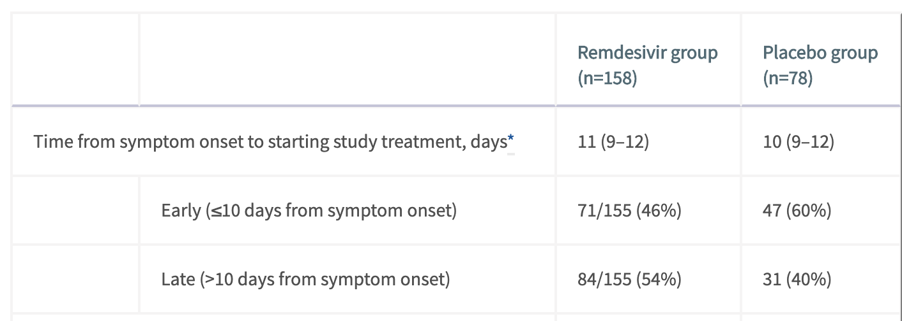
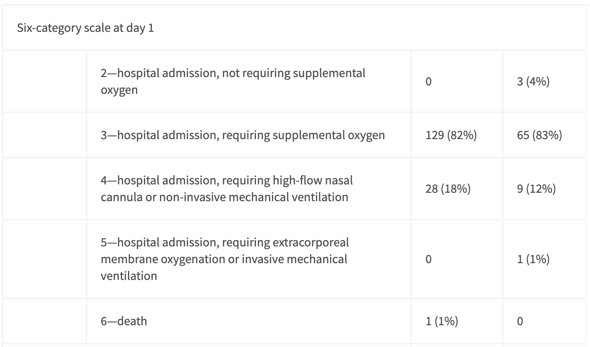
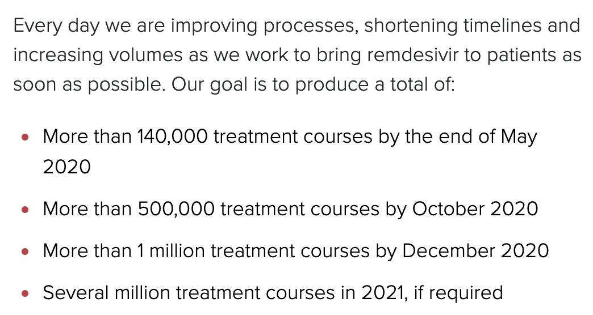
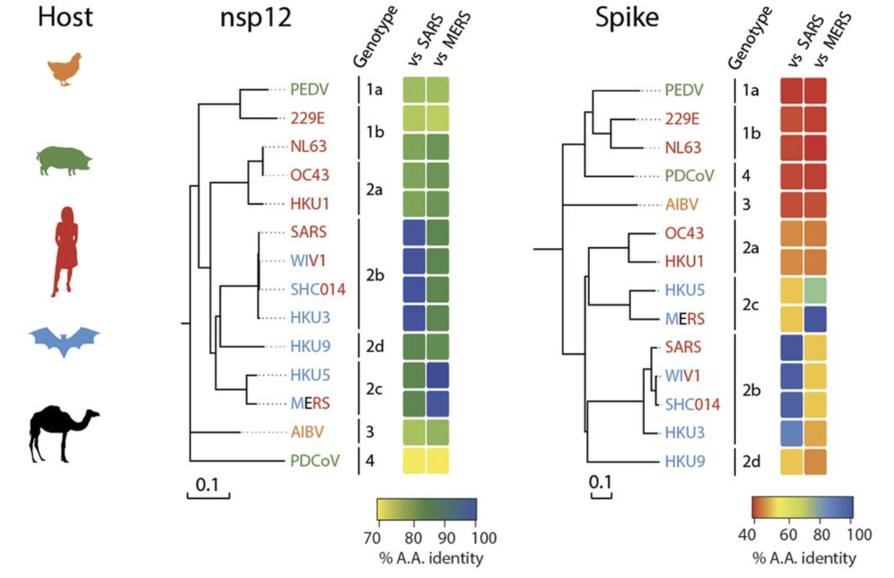

With the early announcement of the positive [NIH double blinded RCT results](https://www.niaid.nih.gov/news-events/nih-clinical-trial-shows-remdesivir-accelerates-recovery-advanced-covid-19), we know with high confidence that Remdesivir works. Looking at what little data we have and the [other recently published China based Remdesivir RCT](https://www.thelancet.com/journals/lancet/article/PIIS0140-6736(20)31022-9/fulltext), I believe it is likely that our current Remdesivir results are a lower bound on its efficacy. This is because of when treatment began relative to symptoms.

From the [NIH announcement](https://www.niaid.nih.gov/news-events/nih-clinical-trial-shows-remdesivir-accelerates-recovery-advanced-covid-19) on April 29th: 

> Preliminary results indicate that patients who received remdesivir had a 31% faster time to recovery than those who received placebo (p<0.001). Specifically, the median time to recovery was 11 days for patients treated with remdesivir compared with 15 days for those who received placebo. Results also suggested a survival benefit, with a mortality rate of 8.0% for the group receiving remdesivir versus 11.6% for the placebo group (p=0.059).

This is good news but no panacea. 

On the same day as the NIH announcement, the Lancet published a [China based Remdesivir RCT](https://www.thelancet.com/journals/lancet/article/PIIS0140-6736(20)31022-9/fulltext). This study was underpowered and failed to produce statistically significant results that Remdesivir was effective. However, independent of the sample being too small, the authors acknowledged and found evidence for  starting their treatment too late.

Not only did approximately half of their participants recieve treatment 10 days after their symptom onset (Figure 1) but also almost everyone required at least some form of supplemental oxygen (Figure 2)!

Figure 1. The inter quartile range for both treatment and placebo groups is (9-12) meaning that at least 25% of those treated before day 10 were on day 9 of their symptoms. Taken from Table 2 of [Wang et al.](https://www.thelancet.com/journals/lancet/article/PIIS0140-6736(20)31022-9/fulltext)

The columns here follow the same ordering as in Figure 1. Taken from Table 1 of [Wang et al.](https://www.thelancet.com/journals/lancet/article/PIIS0140-6736(20)31022-9/fulltext)

Clearly in these participants SARS-CoV-2 had already spread widely before treatment began. While the results were not statistically significant, the following is of particular note:

> Results for time to clinical improvement were similar in the per-protocol population (median 21·0 days [IQR 13·0–28·0] in the remdesivir group vs 23·0 days [15·0–28·0] in the placebo group HR 1·27 [95% CI 0·89–1·80]; appendix pp 2–3, 5). Although not statistically significant, in patients receiving remdesivir or placebo within 10 days of symptom onset in the ITT population, those receiving remdesivir had a numerically faster time to clinical improvement than those receiving placebo (median 18·0 days [IQR 12·0–28·0] vs 23·0 days [15·0–28·0]; HR 1·52 [0·95–2·43]; appendix p 6).

To summarize this, when only looking at those whose symptoms had started less than 10 days before (remember at least half of these people were on symptom day 9 though...) the results were close to being statistically significant and reduced the time to clinic improvement by 5 days. This is one day faster than the NIH study[^improvement].

It is unclear to me why the times to clinical improvement are generally so much longer (~20 days) than those cited in the NIH study (~12 days). My guess is that the definitions of recovery are slightly different rather than the Chinese patients being significantly more sick as the death rate was 13% in the placebo group, not much higher than the 11.6% for NIH.

We will know for sure soon but it seems likely that the NIH study also began treatment late in symptom onset. This is not only because of the frequent monitoring required by the study and multi-day IV injections lending itself to hospitalized patients, but also the death rate of 11.6% in placebo being much higher than current SARS-CoV-2 case fatality rates of ~1% to 4%[^CFRDiffs].

This means that the statistically significant 4 day improvement in recovery times shown by the NIH may be a lower bound with faster recovery possible if treatment starts sooner. My prior for this being true is quite strong because of the exponential replication and infection of cells by viruses. This early treatment efficacy has also been shown for  survival rates in [mice](https://stm.sciencemag.org/content/9/396/eaal3653) and [rhesus monkeys](https://www.biorxiv.org/content/10.1101/2020.04.15.043166v2) that showed strong efficacy. In the rhesus monkey study, treatment started only 12 hours after SARS-CoV-2 *infection* (not symptom onset).

Unfortunately, even if Remdesivir is more effective with faster intervention, there are a few barriers towards this being a game changing treatment.  

The biggest barrier is limited production capacity. With ~80,000 people now being confirmed as infected around the world every day (with many more untested infections. https://ourworldindata.org/covid-cases April 30 - May 1st data). Meanwhile, by the end of May, Gilead forecasts having only ~140,000 treatment courses (Figure 3).  

Figure 3. Statement taken from [Gilead's website](https://www.gilead.com/purpose/advancing-global-health/covid-19/working-to-supply-remdesivir-for-covid-19)

There is some good news. Gilead has conducted their own RCT and [shared early results](https://www.gilead.com/news-and-press/press-room/press-releases/2020/4/gilead-announces-results-from-phase-3-trial-of-investigational-antiviral-remdesivir-in-patients-with-severe-covid-19) that they see the same efficacy with a 5 day treatment regiment as with the previously used 10 day (which was also used in the NIH study). This will double supplies but still not be nearly enough.

I am curious to learn more about why mass production will take so long given that it is a small molecule without limitations many biological based vaccines will have. The systhesis pathway of Remdesivir is outlined [here](https://en.wikipedia.org/wiki/Remdesivir#Synthesis).  

Another barrier is the IV delivery mechanism. This will make it much harder to provide Remdesivir to patients as soon as they are tested to be SARS-CoV-2 positive when the treatment is likely to not only be the most effective but also would  require a smaller dosage, conserving resources.

To end this piece on a more optimistic note, the probability of viral escape from Remdesivir seems to be low. This is because of how crucial the RNA-dependent RNA-polymerase is to not only SARS-CoV-2 and coronaviruses more broadly (see Figure 4) but also RNA viruses in general, as evidenced by the fact that Remdesivir was developed as an Ebola treatment. The evoultionary conservation of RNA-dependent RNA-polymerase can be seen in Figure 4. This is good news given that ["94% of the zoonoses documented from 1990 to 2010"](https://science.sciencemag.org/content/359/6378/872.full?platform=hootsuite) are RNA viruses.

Figure 4. We can see the conservation of nsp12 which is the RNA-dependent RNA-polymerase across the coronavirus family. Taken from Figure 3 of [Sheahan et al.](https://stm.sciencemag.org/content/9/396/eaal3653)

This result has also been backed up by the result that "coronaviruses partially resistant to inhibition by remdesivir (about six-times increased EC50) have been obtained after serial in vitro passage, but these viruses remain susceptible to higher remdesivir concentrations and show impaired fitness." (quote taken from [Wang et al.](https://www.thelancet.com/journals/lancet/article/PIIS0140-6736(20)31022-9/fulltext) in reference to [this paper](https://mbio.asm.org/content/9/2/e00221-18) )

### Footnotes
* footnotes will be placed here. This line is necessary
{:footnotes}

[^improvement]: The "time to clinical improvement" is defined as "the time (in days) from randomisation to the point of a decline of two levels on a six-point ordinal scale of clinical status (from 1=discharged to 6=death) or discharged alive from hospital, whichever came first." A weaker bar than the NIH's time to recovery, however referring to Figure 2, for over 82% of both treatment and placebo groups this two level decrease corresponds to hospital release.

[^CFRDiffs]: There is high variance around CFR numbers for different countries which depends on factors including: the number of tests being conducted; the medical care available; and reporting rates (see <https://ourworldindata.org/grapher/coronavirus-cfr> for inter-country comparisons). The closest comparison should be to the US CFR because NIH stated that "Sixty-eight sites were involved in the study including: 47 in the United States and 21 countries in Europe and Asia." In addition, the global number seems to be between ~1% and 4% across a number of recent studies: <https://www.thelancet.com/journals/laninf/article/PIIS1473-3099(20)30244-9/fulltext> <https://www.thelancet.com/journals/laninf/article/PIIS1473-3099(20)30246-2/fulltext> <https://www.who.int/dg/speeches/detail/who-director-general-s-opening-remarks-at-the-media-briefing-on-covid-19---3-march-2020>. 